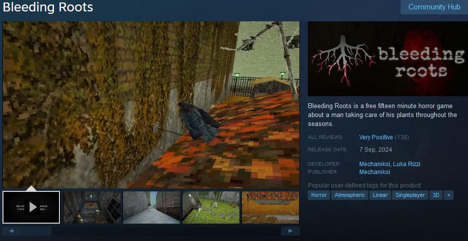
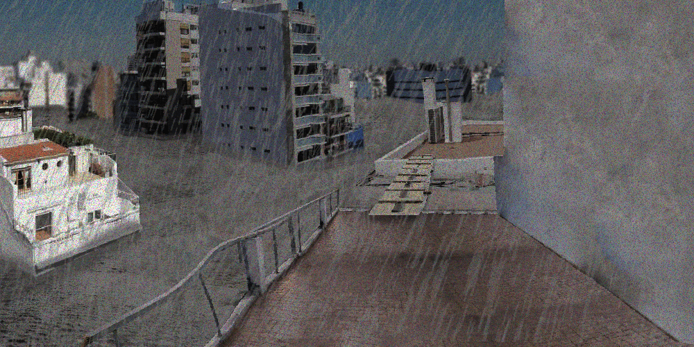

So, a bunch of things have happened over these past few weeks, and since it's now spring IRL (at least for us in the southern hemisphere), I think it's the perfect time to make some announcements!

## Bleeding Roots reception

First off, we want to thank everyone who has played, reviewed, and/or shared Bleeding Roots. Special shoutout to the gaming news outlets that have given it exposure, like [NoGamingNews](https://nogamingnews.com/bleeding-roots-cuidar-el-jardin-nunca-fue-tan-perturbador), [GamesArdor](https://gamesardor.net/top-steam-games-to-lookout-for-in-september-2024/), [ExtraGamers](https://www.extragamers.com.ar/2024/09/el-juego-argentino-bleeding-roots-ya-esta-disponible-en-steam-de-manera-gratuita.html) & [PressOver](https://www.youtube.com/watch?v=12dIjwJYr00).
We're really excited to see that some people truly understood the game and were touched by its story and atmosphere. Personally, I've come to love a particular synopsis I've seen in a few comments and blogs. It goes something like: 'Bleeding Roots is a short, psychological horror story that happens to be playable.' It's a simple line, but I feel like it sums up the game perfectly.

When we started development, the idea was to make something cool while working together, hoping it would turn into a solid portfolio project. I remember a call with [Luka](https://x.com/lukahizoalgo) when the game's Steam page got approved ' we were speculating about the possible reception. I said my most optimistic expectation was to hit 100 wishlists. Fast forward a few weeks later and I still can't believe it has well over that amount, not of wishlist but POSITIVE REVIEWS, and 750+ Wishlists even though it's a free game. Across Steam and Itch.io, we've racked up more than 70,000 visits and around 8,000 downloads.

## Gamedev events

On September 28th we will be present at [FIJA](https://x.com/FIJA_vj), a very cool local event featuring a bunch of very cool people and their very cool indie games. It'll be a pleasure to hang out and chat with the community and other devs.

We've also been selected for the [EVA PLAY](https://expoeva.com/en/) online videogame catalog. This is a big achievement for us, as the EVA expo is the largest gamedev event in Argentina, and we're very proud and excited about it. This year's event will take place from October 23rd to 26th.

We'd love to see you at these events, so be sure to check them out!

## What's next?

Bleeding Roots has recently been updated to include a Spanish translation, and we're currently working with some amazing people to add more languages, including Portuguese, Mandarin, Russian, and Japanese. We'll update the game as soon as they're ready!

Lastly, all the kind feedback we've received has inspired the whole team to start a new project. It's going to be bigger and a bit more ambitious than Bleeding Roots. I won't reveal too much since it's still in the very early stages, but I'll leave you with this little teaser and stay tuned!

