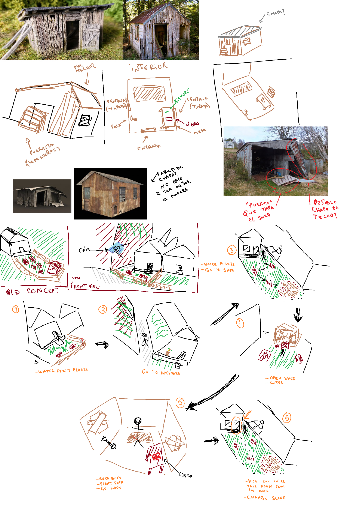
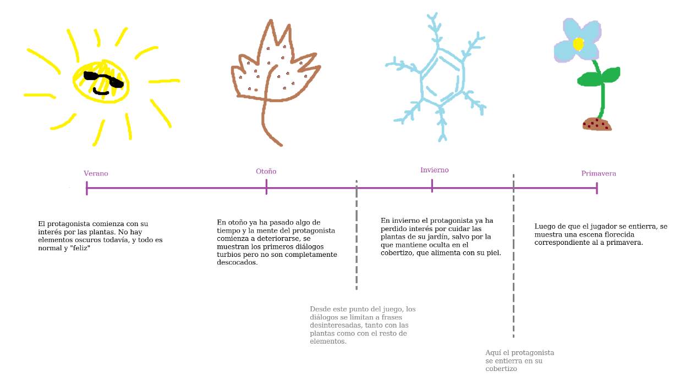
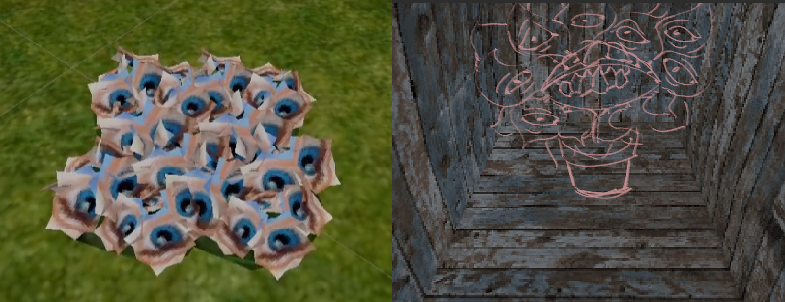

We started MechaniKoi more than a year ago in hopes of working together to create something that we could be proud of. Though we as a team knew each other for some time now (we even worked together before) this is the first time we have the chance to work on something that we can call our own. From the first ideas, through the development and to the final product, we were in every single unnoticeable detail and to the last commit on the repository.

#### This first chance we named Bleeding Roots

*The idea for the name was originally from Tom, who developed this very website :) Thank you Tom!*

Bleeding Roots is a short narrative experience, it's humble yet we are very proud of it as it not only delivers a bunch of emotions for the players to enjoy, but it is also proof of our chemistry as a team. **It's a 15 minute, completely free** psychological horror walking simulator where you embody a lonely man who likes taking care of his garden, when he discovers a strange book about alternative ways to grow them. 

It recently launched on [Steam](https://store.steampowered.com/app/3091770) and [Itch.io](https://mechanikoi.itch.io/bleedingroots) and seriously we're in desbelief of the feedback we've been getting. We're so happy that people are enjoying it and we're so grateful for the support from the community and local press. As of today, it almost reaches 100 reviews and over a thousand Wishlists on Steam, we've been having a blast watching some people streaming it on Twitch, gameplay videos on YouTube and so on.

As a form of thank you and for everyone who've felt touched enough by the game to reach this blog, we'd like to share some funny and just maybe interesting pictures of the development process. 

 
*How it started*

*Did you know originally the seasons were arranged differently?*

*Yes, that is Johntron. He was our placeholder character model. Idk why either*

*Totally serious storyboarding*

*Some plant concepts*

*Breakdance*

Thanks again from the bottom of our eldritch plant hearts.
