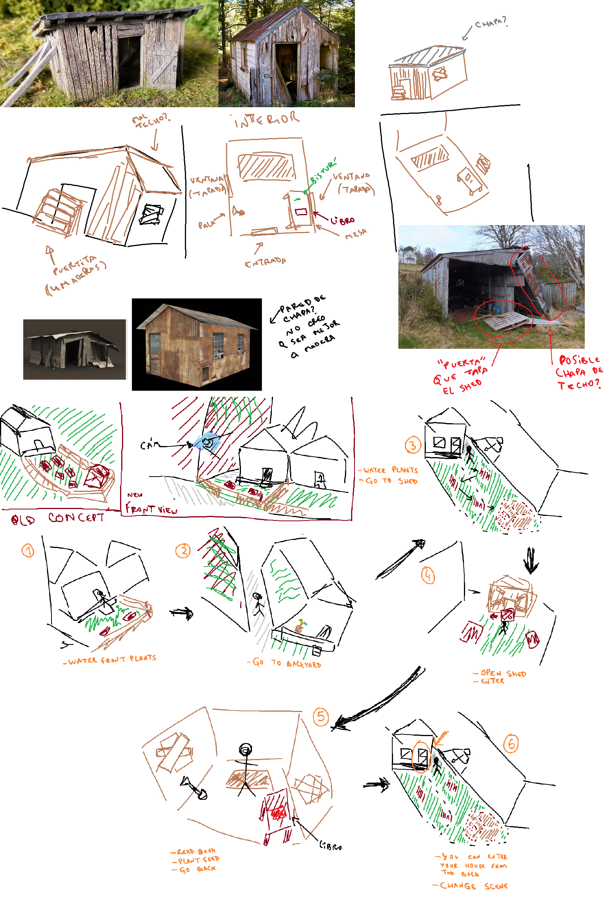
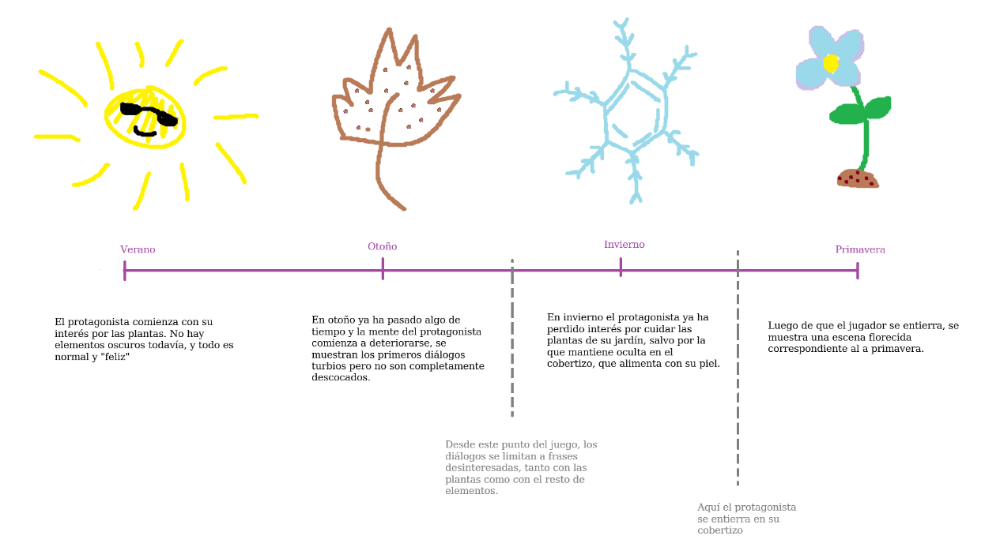
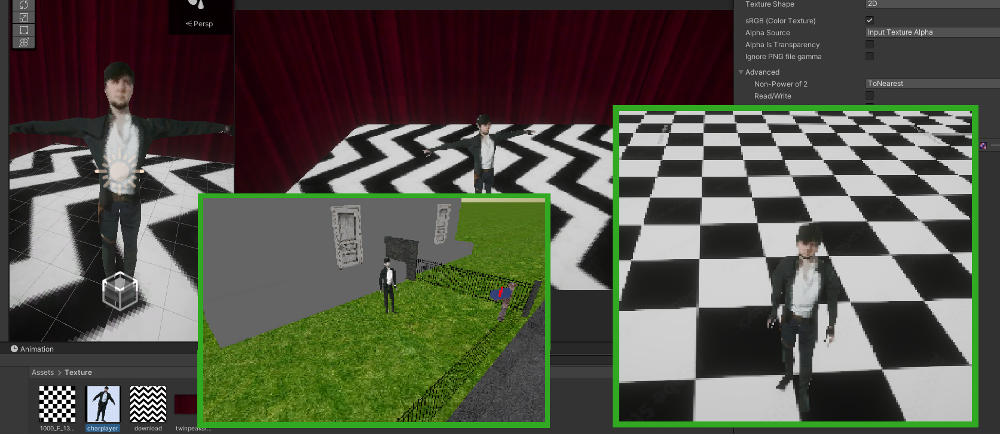
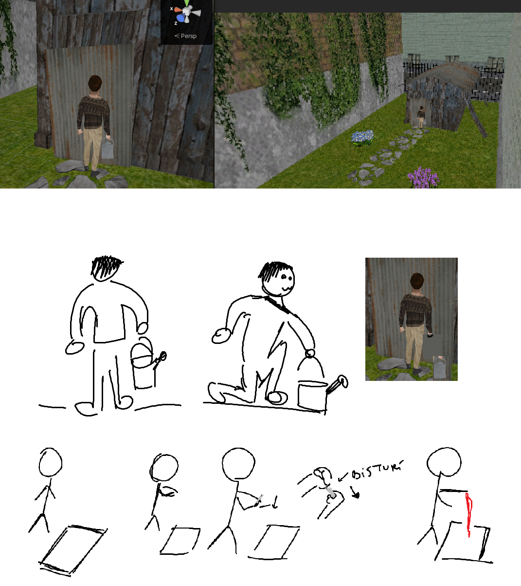
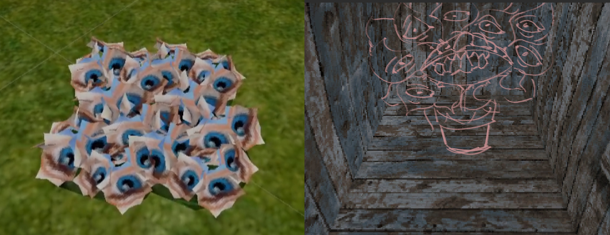
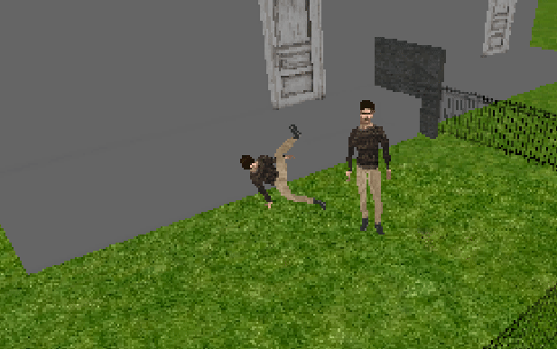

Empezamos MechaniKoi hace más de un año con la esperanza de trabajar juntos para crear algo de lo que pudiéramos sentirnos orgullosos. Aunque en el equipo nos conocemos desde hace un tiempo (incluso habíamos trabajado juntos antes), esta es la primera vez que tenemos la oportunidad de trabajar en algo que podamos llamar propio. Desde las primeras ideas, pasando por el desarrollo y hasta el producto final, estuvimos presentes en cada detalle imperceptible y hasta el último commit en el repositorio.

#### A esta primera oportunidad la llamamos Bleeding Roots.

*El nombre fue originalmente idea de Tom, quien también desarrolló este mismo sitio web :) Gracias, Tom!*

Bleeding Roots es una experiencia narrativa corta, es humilde, pero estamos muy orgullosos de ella, porque no solo transmite una serie de emociones para que los jugadores pueden disfrutar, sino que también es prueba de nuestra química como equipo. Es un walking simulator de terror psicológico, **dura 15 minutos y es completamente gratuito**. En Bleeding Roots encarnas a un hombre solitario que disfruta de cuidar su jardín, y termina descubriendo un extraño libro que describe métodos algo alternativos de hacer crecer sus plantas.

Recientemente se lanzó en [Steam](https://store.steampowered.com/app/3091770) e [Itch.io](https://mechanikoi.itch.io/bleedingroots), y sinceramente estamos absolutamente atónitos por la recepción que tuvo. Nos alegra mucho que la gente lo esté disfrutando y estamos muy agradecidos por el apoyo de la comunidad y la prensa local. Al día de la fecha casi ha alcanzado las 100 reseñas y más de mil Wishlists en Steam, y nos hemos divertido mucho viendo a streamers transmitiéndolo en Twitch, videos de gameplay en YouTube y demás.

Como una forma de agradecimiento, y para todos aquellos que se hayan sentido lo suficientemente tocados por el juego como para llegar hasta este blog, nos gustaría compartir algunas fotos divertidas y, tal vez, interesantes del proceso de desarrollo. 

 
*Como empezó*

*Sabías que las temporadas del juego tenían otro orden originalmente?*

*Sí, es Johntron. Fue nuestro modelo placeholder. Idk*

*Storyboarding totalmente serio*

*Algunos conceptos de las plantas*

*Breakdance*

Gracias nuevamente desde el fondo de nuestros plantíferos y demoníacos corazones.