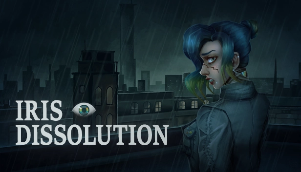
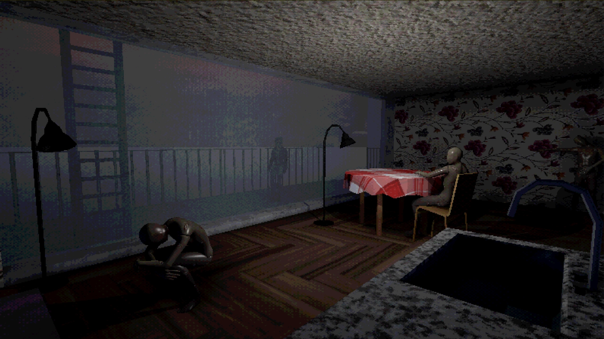
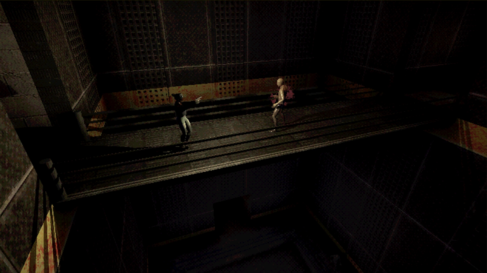
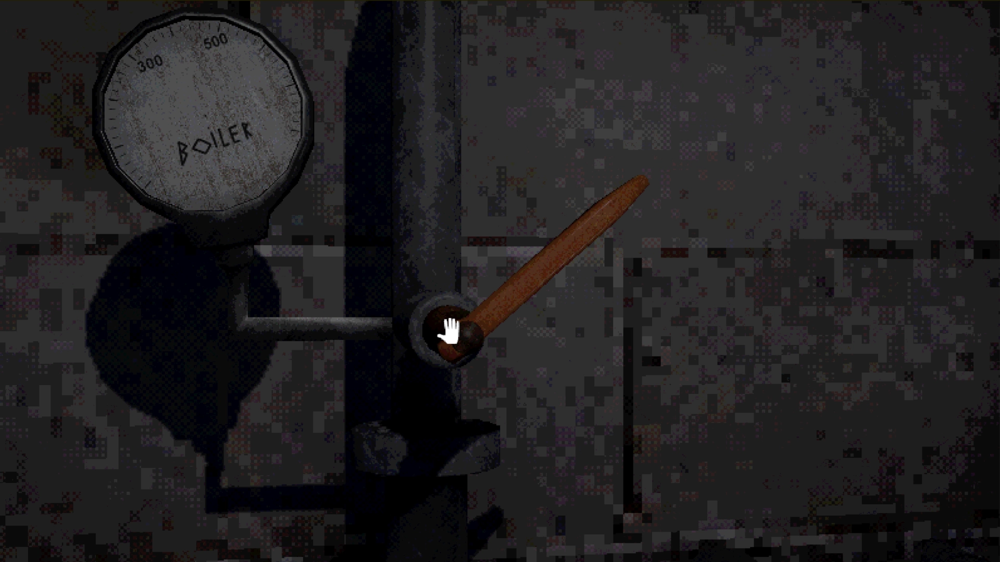
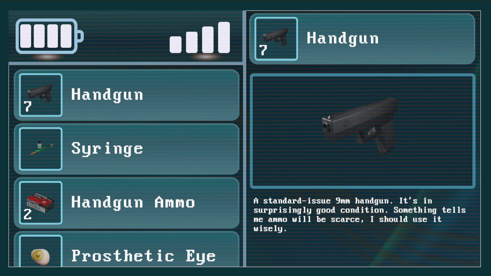

## Iris Dissolution

Iris Dissolution es un juego de survival horror para un solo jugador inspirado en los clásicos del género. Explora y lucha para escapar de entornos cada vez más surrealistas acechados por criaturas horribles, mientras lidias con la pérdida.

Con ángulos de cámara fijos, gestión estratégica del inventario y acertijos complejos, el juego ofrece una experiencia nostálgica junto a una conmovedora historia de duelo y desesperanza.

Tras horas de viaje en motocicleta, Iris llega a un pueblo desolado. Busca a su hermano menor, pero también a quienquiera que pueda ayudarla. Después de encontrarse con un misterioso anciano en un bar, comienza a darse cuenta de que este lugar no es lo que parece. Aun así, sigue sin ver que está vivo y que ella se está quedando sin tiempo. Aún así, está decidida a encontrar a su hermano.

## [Presskit](https://drive.google.com/drive/folders/12HAT3lyDOPyLl13dgNdBhOCcvzCULKC6?usp=drive_link)

